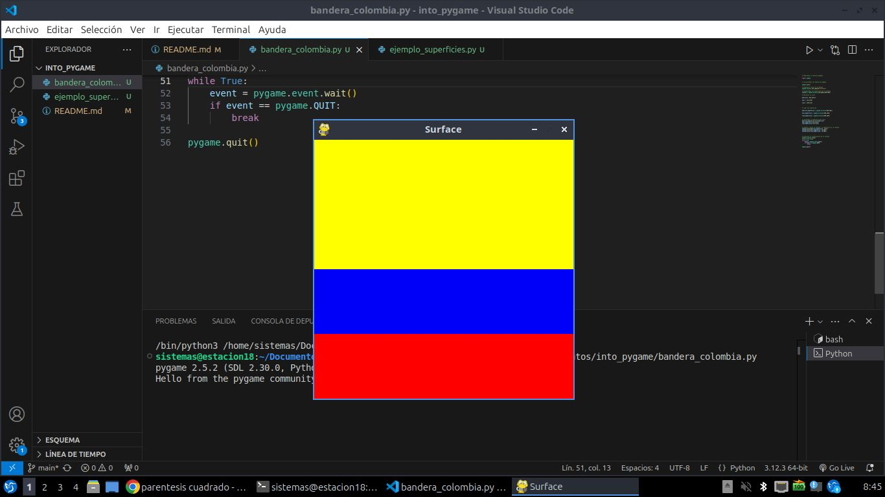

# estructura de un juego de pygame

## inicializacion
como en todo programa en python se deben importar los modulos o librerias a utilizar

import pygame

los diguiente es inicializar pygame utilisando la funcion 

```pygame.init()```

## visualizacion de la ventana

```ventana = pygame.dicplay.set_mode((600, 400))```

- set_mode es la funcion encargada de definir el tamaño de la ventana. En el ejemplo, se esta definiendo una ventana de 600 px de ancho, por 400 px de alto. 

```pygame.display.set_caption("mi ventana")```

- set_caption() es la funcion que añade un titulo a la ventana 

### funciòn set_mode()

```set_mode(size =(0, 0), flags = 0, depth = 0, display = 0)```

- size = (600.400): define el tamaño de la ventana

- flags: define uno o mas comportamientos para la ventaa.
    - valores:
        - pygame.FULLSCREEN
        - pygame.RESIZABLE
    - ejemplo:
        - flaga = FULLSCREEN pygame.RESIZABLE: pantalla completa o dimensiones de la pantalla modificables.

##  bucle del juego o game loop
- bucle infinito que se interrumpirà al cumplir siertos criteriios
- reloj interno del juego
- en cada iteracio del bucle del juego podemos mover a un personaje, o tener en cuenta de que un objeto a alcansado a otro o que se ha crusado la linea de llegada, lo que quiere decir que la partida a terminado
- cada iteracion es una oportunidad para atualizar todos los datos relacionados con el estado actual de la partida.
- en cada iteracion se realisa las siguientes tareas:
    1. comprobar que no se alcansan las condiciones de parada, en cuyo caso se interrumpe el bucle
    2. actualizar los recursos necesarios para la iteracion actual
    3. obtener las entradas, o de iteraccion con el jugador
    4. actualizar todas las entidades que caracterisan el juego
    5. refrescar la pantalla

    ## superficies pygame
    - superficie:
        - es u elemento geometrico.
        - linea , poligono, imagen,texto que se muestra en la pantalla.
        - el poligono se puede o no rellenar de color.
        - las superficies se crean de diferente manera deendiendo del tipo
        - imagen: ```image.load()```
        - texto: ```font.render()```
        - superficie generica: ```pygame.surface()```
        - ventana del juego: ```pygame.display.set_mode()```


# bandera: 

```python
# importamos la libreria pygames

import pygame


# inicializamos los modulos de pygame 

pygame.init()

# establecer titulo a la ventana 
pygame.display.set_caption("Surface")

# establecemos las dimensiones de la ventana 
ventana = pygame.display.set_mode((400,400))

# definimos un color 

amarillo= (255,255,0)

azul = (0,0,250)

rojo = (255,0,0)


# crear una superficie 

amarillo_Superficie = pygame.Surface((400,200))

azul_Superficie = pygame.Surface((400,100))

rojo_Superficie = pygame.Surface((400,100))


# rellenamos la superficie del color
amarillo_Superficie.fill(amarillo)
azul_Superficie.fill(azul)
rojo_Superficie.fill(rojo)


# inserto o muevo la ventana  la superficie en la ventana
ventana.blit(amarillo_Superficie, (0,0))
ventana.blit(azul_Superficie, (0,200))
ventana.blit(rojo_Superficie, (0,300))


# actualiza la visualizacion de la ventana 
pygame.display.flip()
# bucle del juego
while True: 
    event = pygame.event.wait()
    if event == pygame.QUIT: 
        break 

pygame.quit()

```


